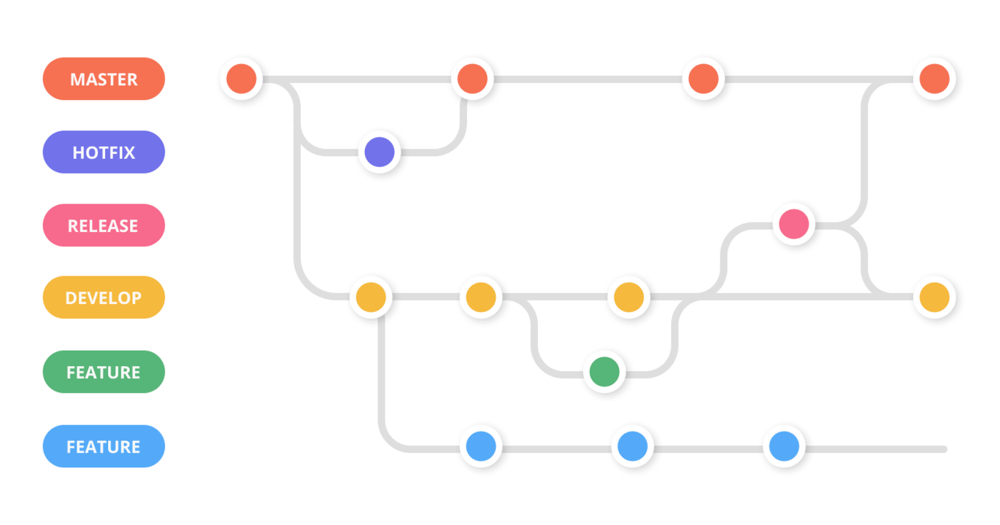

# Contributing to project

We would love for you to contribute to Angular and help make it even better than it is today!
As a contributor, here are the guidelines we would like you to follow:

 - [Submission Guidelines](#submit)
 - [Commit Message Guidelines](#commit)

## <a name="submit"></a> Submission Guidelines



### <a name="submit-pr"></a> Submitting a Pull Request (PR)

Before you submit your Pull Request (PR) consider the following guidelines:

1. [Fork](https://docs.github.com/en/github/getting-started-with-github/fork-a-repo) the repo.

2. In your forked repository, make your changes in a new git branch:

     ```shell
     git checkout -b my-fix-branch master
     ```

3. Create your patch, **including appropriate test cases**.

4. Run the full test suite, and ensure that all tests pass.

5. Commit your changes using a descriptive commit message that follows our [commit message conventions](#commit).
   Adherence to these conventions is necessary because release notes are automatically generated from these messages.

     ```shell
     git commit --all
     ```
    Note: the optional commit `-a` command line option will automatically "add" and "rm" edited files.

6. Push your branch:

    ```shell
    git push origin my-fix-branch
    ```

7. Send a pull request to `master branch`.

### Reviewing a Pull Request

#### Addressing review feedback

If we ask for changes via code reviews then:

1. Make the required updates to the code.

2. Re-run the Angular test suites to ensure tests are still passing.

3. Create a fixup commit and push to your repository (this will update your Pull Request):

    ```shell
    git commit --all --fixup HEAD
    git push
    ```

    For more info on working with fixup commits see [here](docs/FIXUP_COMMITS.md).

That's it! Thank you for your contribution!


##### Updating the commit message

A reviewer might often suggest changes to a commit message (for example, to add more context for a change or adhere to our [commit message guidelines](#commit)).
In order to update the commit message of the last commit on your branch:

1. Check out your branch:

    ```shell
    git checkout my-fix-branch
    ```

2. Amend the last commit and modify the commit message:

    ```shell
    git commit --amend
    ```

3. Push to your repository:

    ```shell
    git push --force-with-lease
    ```

> NOTE:<br />
> If you need to update the commit message of an earlier commit, you can use `git rebase` in interactive mode.
> See the [git docs](https://git-scm.com/docs/git-rebase#_interactive_mode) for more details.


#### After your pull request is merged

After your pull request is merged, you can safely delete your branch and pull the changes from the main (upstream) repository:

* Delete the remote branch on web UI or your local shell as follows:

    ```shell
    git push origin --delete my-fix-branch
    ```

* Check out the master branch:

    ```shell
    git checkout master -f
    ```

* Delete the local branch:

    ```shell
    git branch -D my-fix-branch
    ```

* Update your master with the latest upstream version:

    ```shell
    git pull --ff upstream master
    ```


#### <a name="commit-header"></a>Commit Message Header

```
<type>(<scope>): <short summary>
  │       │             │
  │       │             └─⫸ Summary in present tense. Not capitalized. No period at the end.
  │       │
  │       └─⫸ Commit Scope
  │
  └─⫸ Commit Type: build|docs|feat|fix|perf|refactor|test
```

The `<type>` and `<summary>` fields are mandatory, the `(<scope>)` field is optional.


##### Type

Must be one of the following:

* **build**: Changes that affect the build system or external dependencies
* **docs**: Documentation only changes
* **feat**: A new feature
* **fix**: A bug fix
* **perf**: A code change that improves performance
* **refactor**: A code change that neither fixes a bug nor adds a feature
* **test**: Adding missing tests or correcting existing tests


##### Scope
The scope should be the name of the package affected (as perceived by the person reading the changelog generated from commit messages).

* none/empty string: useful for `test` and `refactor` changes that are done across all packages (e.g. `test: add missing unit tests`) and for docs changes that are not related to a specific package (e.g. `docs: fix typo in tutorial`).


##### Summary

Use the summary field to provide a succinct description of the change:

* use the imperative, present tense: "change" not "changed" nor "changes"
* don't capitalize the first letter
* no dot (.) at the end